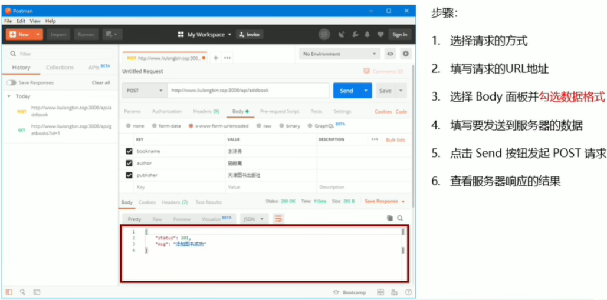
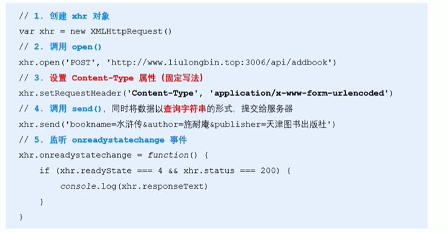
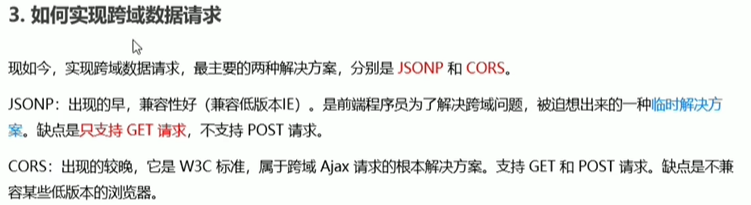

###服务器对外提供资源
####网页中请求数据
在网页中请求服务器上的数据资源，需要用到XMLHttpRequest对象
用法：


####资源请求方式
get请求：用于获取服务端资源
post请求：用于向服务器提交资源

###jQuery的Ajax
####$.get()函数
用于从服务器获取资源


####$.post()函数

####$.ajax()函数


###接口

####接口测试工具
不写任何代码的情况下对接口进行调用和测试
####使用PostMan测试GET接口

####使用PostMan测试POST接口

####接口文档


###form表单

####表单的组成部分

####form标签的属性
#####action

#####target

#####method

即使用get方式数据会在url上看得见，使用post方式看不见
#####enctype

####表单的同步提交


###通过Ajax提交表单数据
####监听表单提交事件

####阻止表单默认提交行为

####快速获取表单中的数据


###模板引擎
####art-template模板引擎

+ 定义模板必须在```<script></script>```里面定义，且type类型为```type="text/html"```
+ 调用template函数：```template(‘模板id名’， 数据)```
####art-template标准语法

 


###模板引擎实现原理
####正则的exec()函数

####提取分组

即从exec匹配的结果中提取用小括号分组的值
####用replace函数替换{{}}


###XMLHttpRequest的基本使用
####使用xhr发起GET请求

####xhr对象的readyState属性
readyState属性用于表示当前Ajax请求所处状态

####使用xhr发起带参数GET请求

 
####URL编码与解码


####使用xhr发起POST请求


###数据交换格式
数据交换格式，即服务器端与客户端之间进行数据传输与交换的格式，主要为XML和JSON
####XML


####JSON

#####JSON的两种结构


**JSON里的字符串一定要用双引号包裹**
**JSON里不能写注释**
#####JSON和JS对象互转

用处：使用xhr请求回来得到的是JSON格式的字符串，可以用JSON.parse（）转化为对象
#####序列化和反序列化


###XMLHttpRequest Level2的新特性

####设置HTTP请求时限

####使用FormData对象管理表单数据


####上传文件


####显示文件上传进度

要放在send（）之前
监听上传完成事件


###jQuery高级用法
####jQuery实现文件上传
1.UI结构定义同上

3.向FormData中追加文件同上

####jQuery实现loading效果
实现上传文件的过程中显示转圈的效果


###axios
axios是专注于网络数据请求的库
####axios发起GET请求

####axios发起POST请求

####直接用axios发起请求


###同源策略和跨域
####同源


####跨域




###JSONP
####实现简单的JSONP

####jQuery中的JSONP


###淘宝搜索案例
####输入框防抖


####缓存搜索的建议列表


###防抖和节流


###HTTP协议简介

#####HTTP协议的交互模型


###HTTP请求消息

####HTTP请求消息的组成部分


###HTTP响应消息
####HTTP响应消息的组成部分


###HTTP请求方法


###HTTP响应状态码

####HTTP响应状态码的组成及分类


###Git基础概念
####Git的特性

**差异比较**

**Git的记录快照**

####Git的三个区域

####Git的三种状态

####工作区中文件的四种状态
未跟踪、未修改、已修改、已暂存


